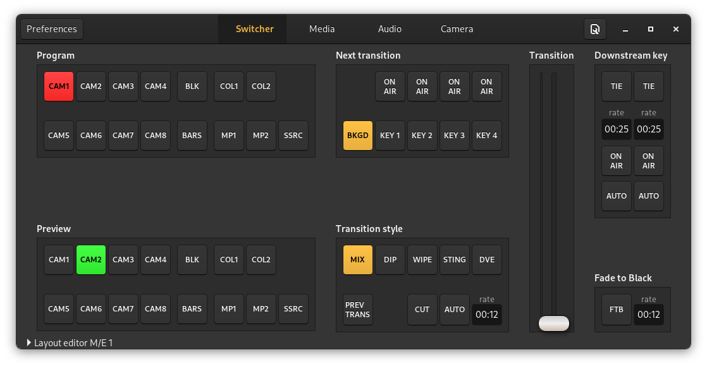
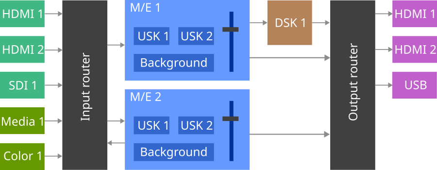
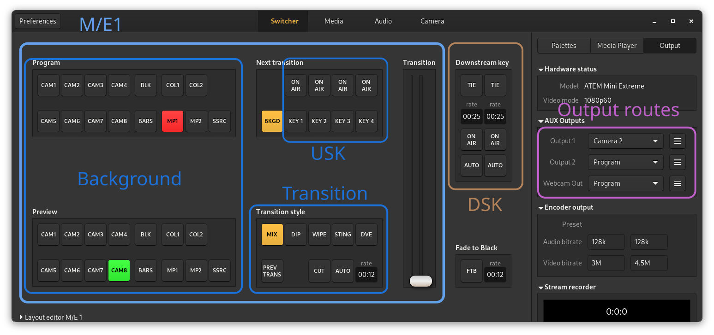

OpenSwitcher manual
===================

The OpenSwitcher application is the reference application for pyatem. It aims to be a feature-complete replacement for
the closed-source Blackmagic Design ATEM Software Control application. It supports connecting to ATEM devices with 8.x+
firmware versions. For communication it supports connecting over the network and USB.

Intro to ATEM switchers
-----------------------

The ATEM series is a line of video switchers/mixers by Blackmagic Design that use an FPGA to do hardware accelerated
video mixing. This provides realtime guarantees for live video productions. For the older products this is a rackmount
device that contains all the video inputs and outputs and is controlled remotely with a hardware control panel. There
are also newer devices in the ATEM lineup that have the video mixer and the control panel in one device, for example
the Mini series that has a limited control panel and the video mixer in a small desktop case, or the Television Studio
HD8 series that build the video mixer component in the formfactor for the older hardware control panels.

The ATEM devices contain one or more M/E units. These are the mix/effect units that provide most of the video processing
functionality. The M/E unit contains a fixed stack of layers. The bottom one being the background layer. This layer is the
one that is controlled by the big fader and the source buttons by default. Then there are one or more upstream keyers.
These are for mixing sources on top of the background in various ways like chroma-keying to remove a green-screen or
using a DVE to shrink and move the video.

After the layering of the M/E units the signals flow further downstream to... the downstream keyers. These add
some more layers on top of the video output of the M/E unit which is then send off to the fade-to-black button all the
way at the end to provide the topmost layer. This signal can then be routed to one of the outputs of the ATEM.

In the image above the general (simplified) signal routing of an ATEM device is shown. On the left in the green boxes
are the inputs, these can be physical inputs on the device like HDMI or SDI connectors, or they can be internal sources
like the media player and the color generator. These all connect into various ways to the M/E units which is shown here
as a big "Input router" block. It basically makes sure that every input is available on every M/E unit. Most cheaper
ATEM devices will have only a single M/E unit in there which simplifies the diagram a bit. The entire ATEM Mini series
falls into this category for example.

Every M/E unit (shown in blue) provides a seperate video composite of the inputs generated with the background layer and
overlays made with the upstream keyers. Every M/E unit also contains a transition unit that can provide a smooth
transition between two states of all the layers in the M/E unit. The M/E unit has a row of buttons for the program bus
and one for the preview bus. The program bus selects which source is used as the background for the M/E unit and the
preview bus selects what the next source will be that's displayed after the transition.

The output of the M/E unit is then run through the downstream keyers (shown in brown) to provide an extra static overlay
that is not affected by transitions. An example for the use of this feature is the channel logo in the corner for the
screen. The result of this after the downstream keyers is called the "Program feed". On some ATEM devices there is a
dedicated output for the program feed and on some newer ATEM devices this can be assigned to one of the "AUX" outputs.

There is also a connection from M/E 1 that bypasses the downstream keyer. This is the "Clean feed" output that provides
a version of the output without DSK overlays, for example to record the show without the logo baked in.

One thing that is not added to the diagram above is that for ATEM devices that have routable AUX outputs it is also
possible to select one of the feeds from the input router directly and send it to an output. This is great to send
a signal to a projector for example so you don't need to split the signal before going into the ATEM.

The more complex ATEM switchers have multiple M/E units, this can be used to make an entirely seperate video mix that
can be routed to one of the outputs for secondary purposes. These secondary M/E units also send the resulting video
mix back into the input router so it can be used as input for another M/E unit. This can be used to prepare a complex
scene to be transitioned to.

Some devices also contain a SuperSource unit. This is a very simplified M/E unit that
removes all transition and most keying functionality. It only has a background and four DVE keyers to scale up to
four sources into boxes. An example usage for this is showing a 4-channel split screen from multiple cameras or computer
captures without taking up the upstream keyers of the main M/E unit.

In the image above the components of the ATEM hardware are roughly marked on the UI of OpenSwitcher. It doesn't
completely match up because several things are split up over multiple panels like the USK and DSK configuration.

It does show though that most of the UI of the ATEM is taken up by the background control for the mix/effect unit.